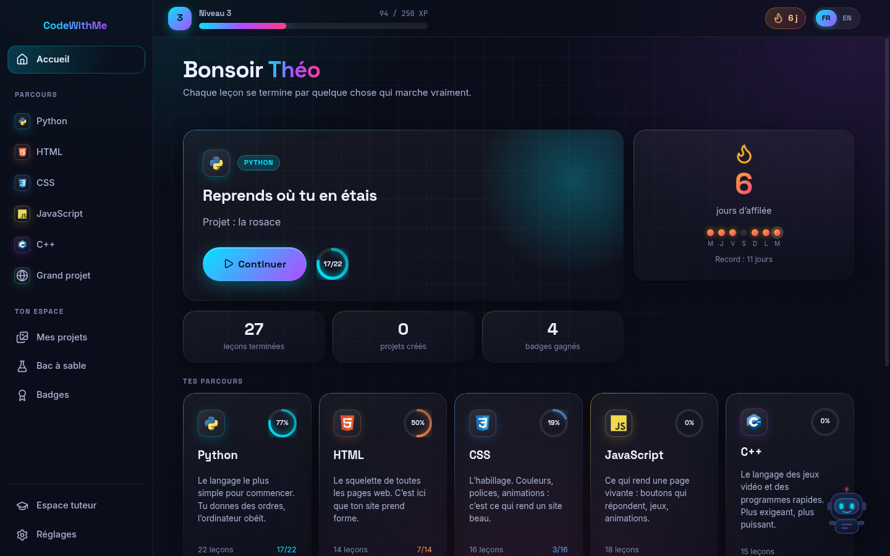
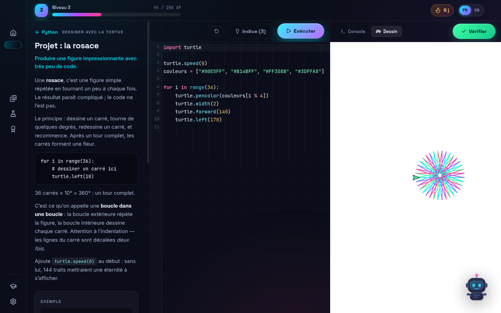
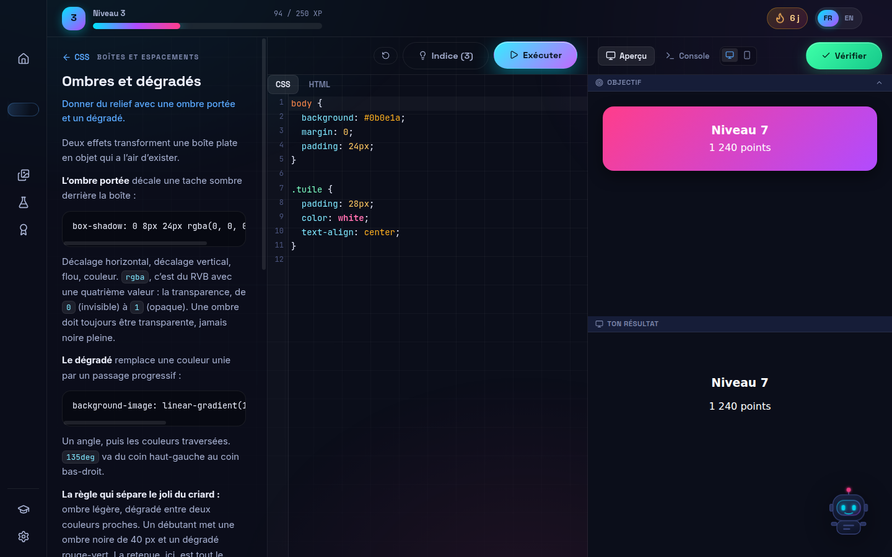
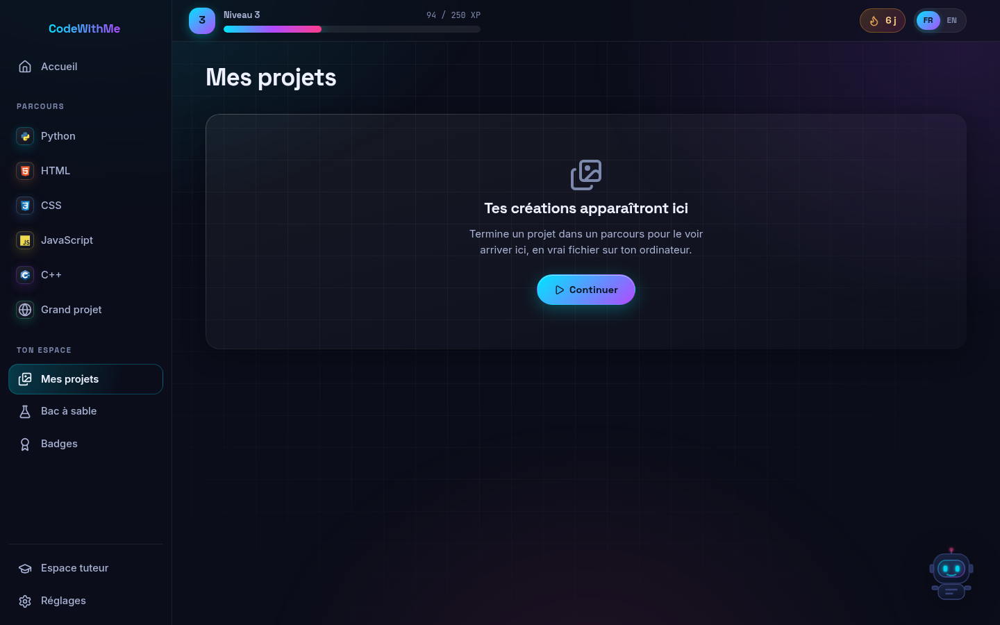
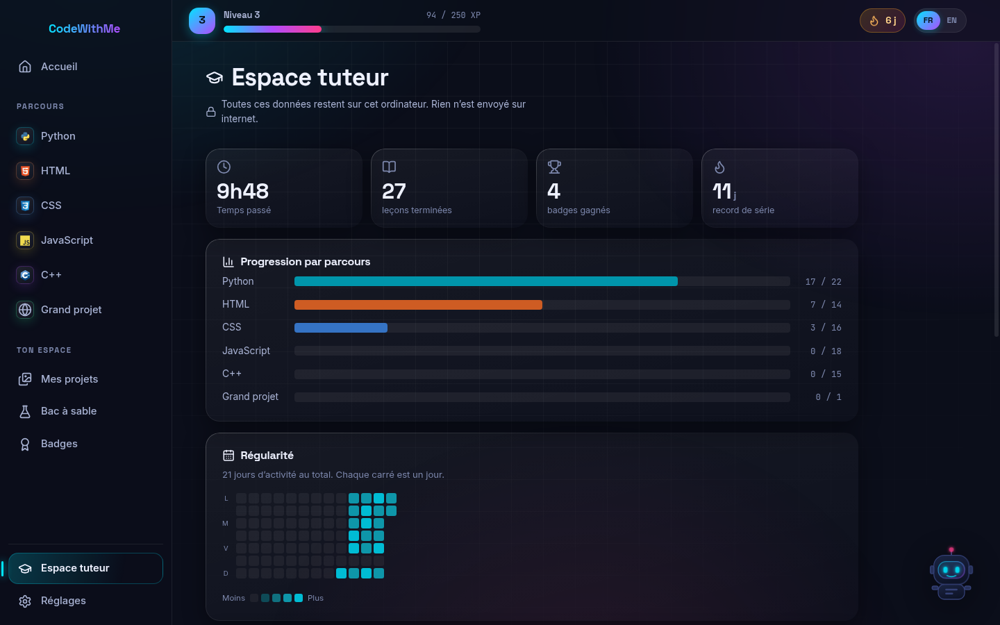
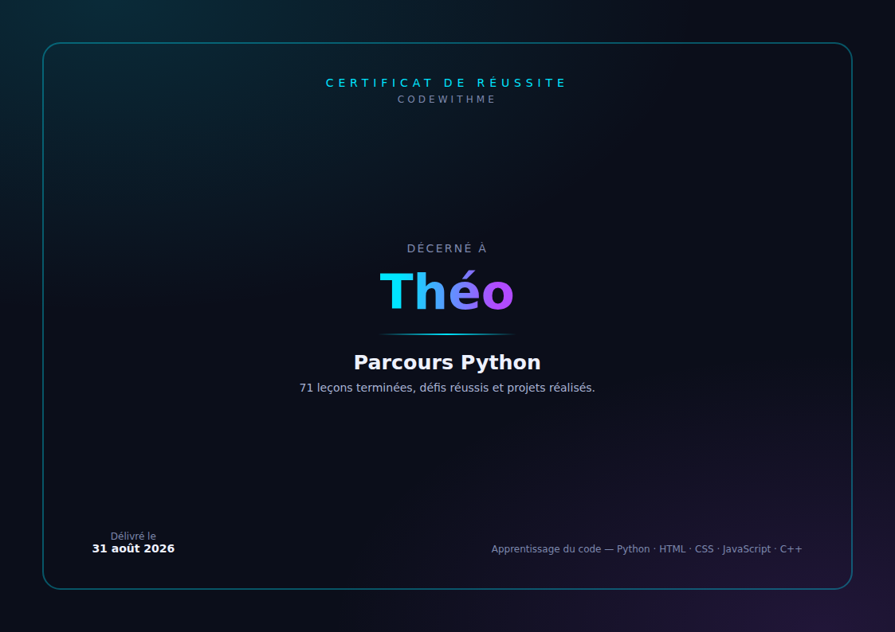

# CodeWithMe

**Apprendre à coder pour de vrai, et voir tout de suite ce que ça donne.**

Une application de bureau pour Windows qui enseigne **Python, HTML, CSS, JavaScript et C++**
à un grand débutant — 86 leçons, 13 projets, et un certificat à la fin.

Tout fonctionne **hors ligne**. Aucune donnée ne quitte l'ordinateur.



---

## Télécharger

Les fichiers se trouvent dans la [page des versions](../../releases/latest).

| Fichier | Pour qui |
|---|---|
| **CodeWithMe-Setup.exe** | La plupart des gens. Installe l'application, crée un raccourci sur le bureau et dans le menu Démarrer. **Aucun mot de passe administrateur n'est demandé.** |
| **CodeWithMe-portable.exe** | Aucune installation. À garder sur une clé USB, ou à utiliser sur un ordinateur où l'installation est bloquée — au collège, par exemple. |

### « Windows a protégé votre ordinateur »

Un écran bleu apparaîtra au premier lancement. **Ce n'est pas un avertissement de virus.**

Windows affiche ce message pour tout programme dont l'éditeur n'a pas payé un certificat de
signature commercial (environ 200 € par an). Il ne dit rien sur le contenu du fichier.

Pour passer outre, en deux clics :

1. cliquer sur **Informations complémentaires** — le texte discret sous le message ;
2. cliquer sur **Exécuter quand même**, le bouton qui vient d'apparaître.

Cela n'est demandé qu'une seule fois.

> Le code source de cette application est entièrement dans ce dépôt, et l'exécutable est
> construit publiquement par GitHub Actions à partir de ce code — les journaux de construction
> sont consultables dans l'onglet Actions.

---

## Ce qu'il y a dedans

### 86 leçons, six parcours

| Parcours | Leçons | Ce qu'il sait faire à la fin |
|---|---:|---|
| **Python** | 22 | Une rosace colorée dessinée par son code, un jeu « devine le nombre » |
| **HTML** | 14 | Sa page de présentation, avec images, liens et tableaux |
| **CSS** | 16 | La même page transformée en vrai site, animations et affichage mobile compris |
| **JavaScript** | 18 | Un quiz interactif, puis un petit jeu jouable au clavier |
| **C++** | 15 | Un jeu de devinette en console, avec compteur de coups |
| **Grand projet** | 1 | Son site personnel, où les trois langages du web tiennent ensemble |

Chaque leçon suit la même structure : une explication sans jargon, un exemple exécutable, un
défi corrigé automatiquement, **trois indices progressifs** puis la solution commentée. Jamais
de blocage.

### Un atelier où le résultat est immédiat



Éditeur à gauche, résultat vivant à droite. Le résultat change de nature selon le parcours :

- **Python** — une console avec `input()` réellement fonctionnel, et un canevas de tortue où
  le tracé s'anime. C'est le principal levier de motivation d'un débutant ;
- **HTML / CSS** — un aperçu qui suit la frappe, un mode **Objectif / Ton résultat** pour les
  défis « reproduis ce visuel », et une bascule **ordinateur / téléphone** pour voir agir un
  `@media` ;
- **JavaScript** — console, aperçu, et `<canvas>` pour les jeux ;
- **C++** — console avec `cout` et saisie `cin`, et les erreurs de compilation traduites en
  français quand elles sont reconnues.



Une boucle infinie ne fige jamais l'application : le code de l'élève tourne à part, et le
bouton *Arrêter* l'interrompt.

### Ses créations deviennent de vrais fichiers



Chaque projet terminé est écrit dans `Documents\CodeWithMe\Mes projets\` — un `.html` autonome,
un `.py`, un `.cpp`. Il peut les rouvrir, les modifier, les montrer à sa famille ou les rendre
en classe. Le fichier fonctionne **sans l'application**.

### Un espace tuteur



Progression par parcours, temps passé, régularité, et surtout les **points de blocage** — les
notions où il a demandé des indices ou multiplié les essais. C'est ce qui permet de l'aider
concrètement. Protégeable par un code à 4 chiffres, et exportable en bilan PDF.

### Un certificat à la fin d'un parcours



À son prénom, imprimable ou enregistrable en PDF.

---

## Pour l'élève

- **Bilingue** français / anglais, avec un bouton dans l'en-tête.
- **Parcours guidé recommandé**, mais aucun verrou : il peut aller où il veut.
- **XP, niveaux, badges, série de jours** et une carte de progression.
- Un **bac à sable** par langage, sans consigne ni note, pour essayer sans être jugé.
- **Bit**, un petit robot qui réagit à son code — et qui se masque en un clic quand il en a
  assez.

---

## Développement

```bash
npm install
npm run vendor      # extrait les bibliotheques embarquees dans vendor/
npm start           # lance l'application
```

### Les contrôles

Rien n'est déclaré fonctionnel sans avoir été exécuté.

| Commande | Ce qu'elle vérifie |
|---|---|
| `npm run check:content` | Les 86 leçons, dans les vrais moteurs : structure bilingue complète, solution de référence qui passe, code de départ qui **ne** passe pas, exemple qui s'exécute |
| `npm test` | 128 vérifications : moteurs, atelier, correction, XP, galerie, espace tuteur, projet final, certificat, et le script qui contrôle les `.exe` produits |
| `npm run test:paquet` | L'application **empaquetée** se lance et fonctionne — c'est là qu'on découvre un fichier manquant |
| `npm run check:contrast` | Contrastes WCAG AA mesurés, et palette des graphiques contrôlée en simulant le daltonisme |
| `npm run check:icones` | Aucun emoji dans l'interface — Windows les dessine lui-même, leur rendu changerait d'une machine à l'autre |
| `npm run check:empaquetage` | La configuration Windows est valide, **sans rien construire** : les noms de fichiers s'étendent réellement et correspondent à ce que le workflow cherche ensuite |

### Architecture

```
electron/    processus principal : protocole app://, menus, profil, projets
app/         interface : modules ES, sans framework
  content/   les 86 lecons, en donnees pures — ajouter une lecon = ajouter un objet
python/      turtle.py, le module tortue maison injecte dans Pyodide
vendor/      Pyodide, JSCPP, CodeMirror, polices — embarques, aucun reseau requis
tools/       vendorisation, controle du contenu, des icones et des couleurs
tests/       Playwright pilotant l'application Electron reelle
```

L'interface est en **JavaScript sans framework**. L'application est riche en contenu, pas en
état complexe : cela réduit les pièces mobiles, et le neveu peut ouvrir le code source du
logiciel qu'il utilise — c'est pédagogique.

Electron est configuré strictement : `contextIsolation`, pas d'accès Node dans le rendu, un
pont IPC nommé et étroit, et le code de l'élève exécuté dans une iframe isolée qui ne peut
atteindre ni son profil ni le reste de l'application.

### Construire le `.exe`

```bash
npm run build:win     # necessite Windows
```

En pratique, la construction est faite par GitHub Actions sur un runner `windows-latest` :
onglet **Actions → Construire l'application Windows**, ou en poussant une étiquette `v1.0.0`,
ce qui publie en plus une Release téléchargeable.

---

## Licences

Le code de l'application est sous licence MIT.

Les bibliothèques embarquées gardent la leur : **Pyodide** (MPL-2.0), **JSCPP** (MIT),
**CodeMirror** (MIT), **Inter**, **Space Grotesk** et **JetBrains Mono** (OFL),
**Lucide** (ISC), **Devicon** (MIT).

Les logos des langages appartiennent à leurs détenteurs respectifs et servent ici à identifier
le langage enseigné, comme dans tout éditeur de code.
